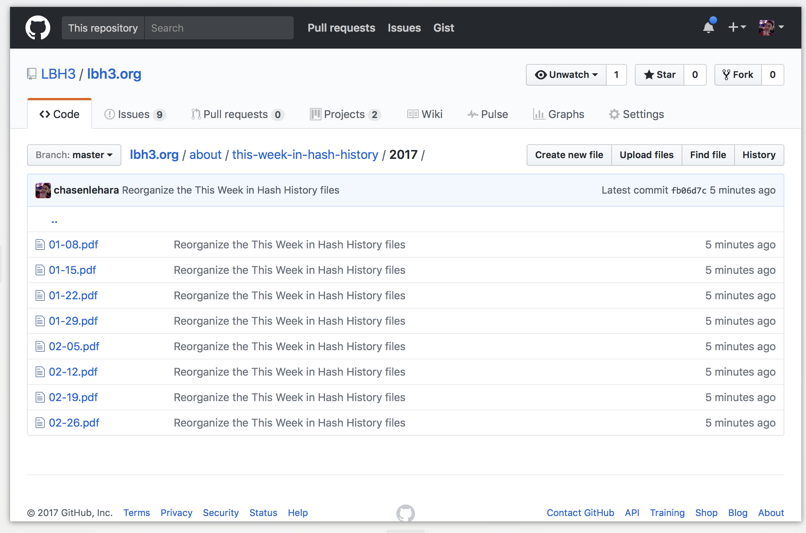
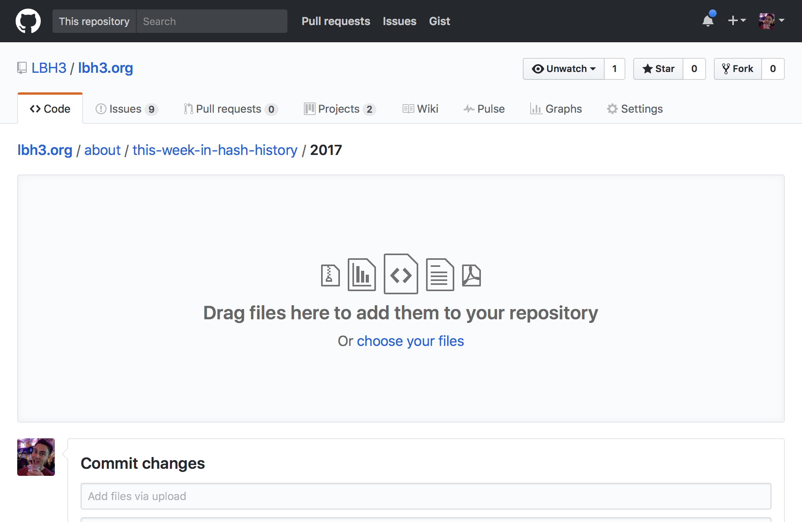
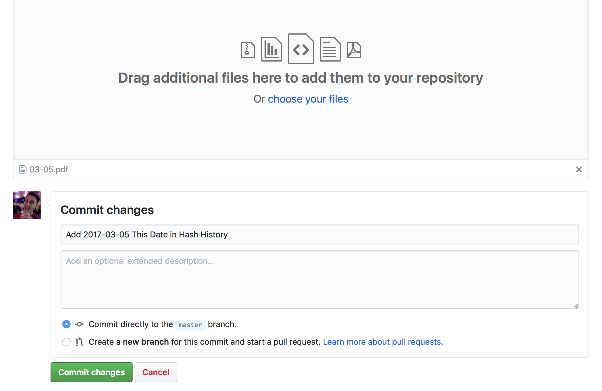
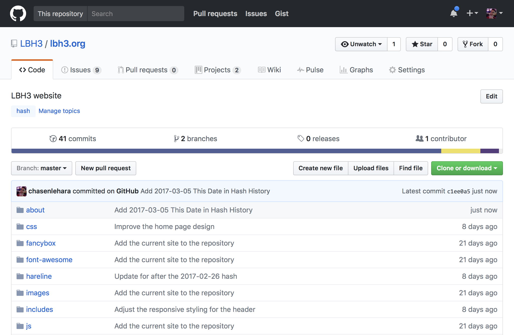

# Updating LBH3.org

If you don’t already have a GitHub account, you’ll need to [create a new one](https://help.github.com/articles/signing-up-for-a-new-github-account/).

## Snooze

### 1. Go to the [2017 Snooze folder](snooze/2017/):

### 2. Click the **Upload files** button and you’ll be able to select the file:

### 3. After uploading the file, scroll down and click **Commit changes**:

You may optionally add a commit message, such as _Add 2017-03-05 Snooze_.

### 4. After the new file is added, you’ll see your name and your commit message (if you added one in step 3):

## This Week in Hash History

### 1. Go to the [2017 This Week in Hash History folder](about/this-week-in-hash-history/2017/):

### 2. Click the **Upload files** button and you’ll be able to select the file:

### 3. After uploading the file, scroll down and click **Commit changes**:

You may optionally add a commit message, such as _Add 2017-03-05 This Date in Hash History_.

### 4. After the new file is added, you’ll see your name and your commit message (if you added one in step 3):

